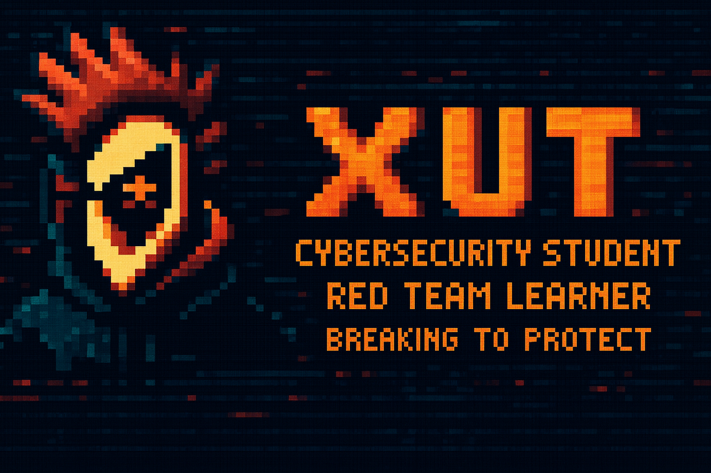

# 

# 👾 XUT / Edu

## 🛡️ Cybersecurity Student | Red Team Learner | Breaking to Protect

---

## 🔥 About Me

I'm **Edu**, also known as **xut**, a **cybersecurity student** based in **Barcelona**. My goal is to learn everything I can about systems, networks, and web applications, developing an offensive mindset to better defend and help people protect their information.

I'm currently studying cybersecurity formally while following an intensive roadmap on **TryHackMe**, aiming at **HackTheBox** and eventually **OffSec**.

---

## 🚀 Learning Roadmap

* Jr Pentester
* Web Fundamentals 
* Web Application Pentesting 
* Web Application Red Teaming &nbsp;&nbsp;&nbsp;&nbsp;&nbsp;&nbsp;&nbsp;&nbsp;&nbsp;&nbsp;&nbsp;&nbsp;&nbsp;&nbsp;&nbsp;<--- Currently here
* Red Team Path
* PT1
* THM Machines
* SOC L1
* SOC L2
* Advanced Endpoint Investigations
* Defending Azure
* SAL1
* Security Engineer
* DevSecOps
* Attacking and Defending AWS
* HTB Machines
* CPTS
* OSCP
* OSEP

---

## 🧠 Languages I Use

* **C++** (my strongest)
* Bash
* Python
* JavaScript
* HTML & CSS

---

## 🛠️ Tools

* **Burp Suite**
* **Metasploit**
* **nmap**
* **gobuster**
* **ffuf**
* **netcat (nc)**
* And more offensive tools...

> If you want more details about specific tools or frameworks, feel free to ask.

---

## 📂 Featured Projects

### 🔐 KeyLogger

➡️ [https://github.com/xut-e/KeyLogger](https://github.com/xut-e/KeyLogger)

### ♟️ Chess Project

➡️ [https://github.com/xut-e/AA2_Ajedrez_Pordomingo_Sanchez](https://github.com/xut-e/AA2_Ajedrez_Pordomingo_Sanchez)

### 🔧 Enigma Machine

➡️ [https://github.com/xut-e/EnigmaMachine](https://github.com/xut-e/EnigmaMachine)

---

## 🎖️ Badges

---

## 🧩 Philosophy

**"Breaking to Protect"**

Learning to think like an attacker to defend like a professional.
